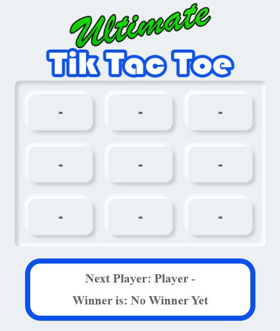

# Tik-Tac-Toe
## Created in React
 

Title: Tic Tac Toe

Description: A Tic Tac Toe game created with React. The code keeps state in many forms and renders accodingly

Directions: Download all files from the repository. Then upload them to your server, once they are uploaded, load index.html into your browser.

Future Improvements: I plan on updating this game with some additional functionality including a reset button, and highlighting a winner

License information: Free to use
